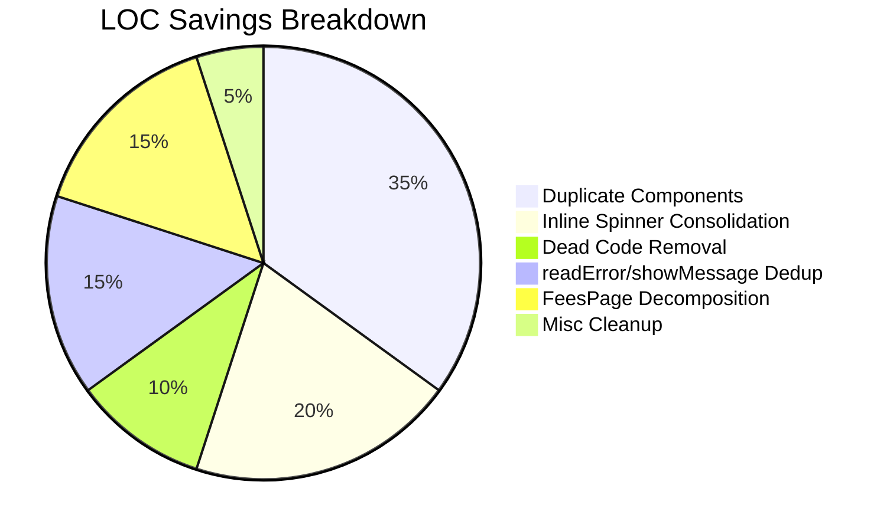

# 🔍 Frontend Code Audit Report

**Project:** School Management System — Frontend  
**Scope:** `frontend/src/` — 148 source files (`.jsx`, `.js`, `.css`)  
**Objective:** Reduce LOC and eliminate inefficiencies while preserving 100% functional & visual parity

---

## 📊 Executive Summary

| Metric            | Value        |
|--------------------|-------------|
| **Total files**    | 148          |
| **Largest file**   | `FeesPage.jsx` — 1,848 lines |
| **Top offenders**  | 6 files > 400 lines each |
| **Issues found**   | 13 distinct issues |
| **Est. LOC savings** | **~600–800 lines** across all changes |
| **Risk level**     | 🟢 Low (all suggestions are safe deletions or extractions) |

### Severity Legend

| Tag | Meaning |
|-----|---------|
| 🔴 **HIGH** | Large, clear-cut duplication — highest ROI |
| 🟡 **MEDIUM** | Moderate savings, easy to fix |
| 🟢 **LOW** | Minor cleanup, nice-to-have |

---

## 🔑 Key Findings



| # | Category | Issue | Files Affected | Est. LOC Saved |
|---|----------|-------|----------------|---------------|
| 1 | Duplicate Component | `EmptyState` defined 3× | 3 | ~40 |
| 2 | Duplicate Component | `StatusBadge` defined 2× | 2 | ~20 |
| 3 | Duplicate Component | `SkeletonRow`/`SkeletonRows` defined 2× | 2 | ~25 |
| 4 | Duplicate Component | `PaginationControls` duplicated | 2 | ~55 |
| 5 | Redundant Logic | `readError()` defined twice | 2 | ~10 |
| 6 | Redundant Logic | `showMessage()` reimplemented 5× | 5 | ~60 |
| 7 | Redundant Logic | `rolePrefix` computed 3× in one file | 1 | ~10 |
| 8 | Inline Repetition | 30+ inline spinner `<div>` patterns | 15+ | ~80 |
| 9 | Dead Code | Empty `App.css` | 1 | file deletion |
| 10 | Dead Code | Unused `custom-scrollbar` CSS block | 1 | ~15 |
| 11 | File Structure | `api/axios.js` is a 3-line re-export of `lib/axios.js` | 3 | ~5 |
| 12 | Component Bloat | `FeesPage.jsx` at 1,848 lines | 1 | ~200–300 (via extraction) |
| 13 | Redundant Logic | Inline `getRelativeTime` in Notifications | 1 | ~15 |

---

## 📋 Detailed Issues & Fixes

---

### Issue 1 — 🔴 Duplicate `EmptyState` Component (3 definitions)

**Locations:**

| File | Line | Signature |
|------|------|-----------|
| [FeesPage.jsx](file:///c:/Users/Jay/School-Management-System/frontend/src/features/fees/FeesPage.jsx#L48-L57) | 48 | `EmptyState({ icon, title, subtitle })` |
| [ResultPage.jsx](file:///c:/Users/Jay/School-Management-System/frontend/src/features/result/ResultPage.jsx#L92-L101) | 92 | `EmptyState({ icon, title, subtitle, action })` |
| [ExaminationPage.jsx](file:///c:/Users/Jay/School-Management-System/frontend/src/features/examination/ExaminationPage.jsx#L38-L49) | 38 | `EmptyState({ icon, title, subtitle, action })` |

**What's identical:** All three render the same pattern — a centered box with an icon, title, and subtitle. The Result and Examination versions also accept an `action` slot.

**Fix:** Extract a single shared `<EmptyState>` to `components/ui/EmptyState.jsx` with the superset props `{ icon, title, subtitle, action }`. Replace all 3 definitions with imports.

```diff
- // In FeesPage.jsx (line 48), ResultPage.jsx (line 92), ExaminationPage.jsx (line 38)
- const EmptyState = ({ icon: Icon, title, subtitle, action }) => ( ... );

+ // New file: components/ui/EmptyState.jsx
+ import React from 'react';
+ export const EmptyState = ({ icon: Icon, title, subtitle, action }) => (
+   <div className="text-center py-12 text-gray-400">
+     {Icon && <Icon className="mx-auto text-3xl mb-2 opacity-50" />}
+     <div className="font-semibold text-gray-500">{title}</div>
+     {subtitle && <div className="text-xs mt-1">{subtitle}</div>}
+     {action && <div className="mt-3">{action}</div>}
+   </div>
+ );

+ // In each consuming file:
+ import { EmptyState } from '../../components/ui/EmptyState';
```

**Savings:** ~40 lines removed (3 × ~13-line definitions → 1 shared file + 3 one-line imports)

---

### Issue 2 — 🟡 Duplicate `StatusBadge` Component (2 definitions)

**Locations:**

| File | Line | Mapping |
|------|------|---------|
| [FeesPage.jsx](file:///c:/Users/Jay/School-Management-System/frontend/src/features/fees/FeesPage.jsx#L31-L38) | 31 | `{ paid: green, pending: yellow, overdue: red, ... }` |
| [ResultPage.jsx](file:///c:/Users/Jay/School-Management-System/frontend/src/features/result/ResultPage.jsx#L59-L88) | 59 | `{ draft: yellow, published: green, locked: gray }` |

**Analysis:** Both components follow the same pattern: look up a status string → return a styled `<span>`. However, they use **different status-to-color mappings** because they serve different domains (fees vs. results).

**Fix:** Extract a generic `<StatusBadge>` to `components/ui/StatusBadge.jsx` that accepts a `colorMap` prop or a unified `STATUS_STYLES` constant.

```diff
+ // New file: components/ui/StatusBadge.jsx
+ const DEFAULT_STYLE = 'bg-gray-100 text-gray-600';
+ export const StatusBadge = ({ status, styles }) => {
+   const s = styles[status] || DEFAULT_STYLE;
+   return <span className={`px-2 py-1 rounded-full text-xs font-semibold ${s}`}>
+     {status}
+   </span>;
+ };

// FeesPage.jsx
+ import { StatusBadge } from '../../components/ui/StatusBadge';
+ const FEE_STATUS_STYLES = { paid: '...', pending: '...', overdue: '...' };
+ <StatusBadge status={fee.status} styles={FEE_STATUS_STYLES} />

// ResultPage.jsx
+ import { StatusBadge } from '../../components/ui/StatusBadge';
+ const RESULT_STATUS_STYLES = { draft: '...', published: '...', locked: '...' };
+ <StatusBadge status={item.summary?.status} styles={RESULT_STATUS_STYLES} />
```

**Savings:** ~20 lines

---

### Issue 3 — 🟡 Duplicate `SkeletonRow`/`SkeletonRows` (2 definitions)

**Locations:**

| File | Line | Name | Usage Count |
|------|------|------|-------------|
| [FeesPage.jsx](file:///c:/Users/Jay/School-Management-System/frontend/src/features/fees/FeesPage.jsx#L40-L46) | 40 | `SkeletonRow({ cols })` | **12 call sites** |
| [ResultPage.jsx](file:///c:/Users/Jay/School-Management-System/frontend/src/features/result/ResultPage.jsx#L103-L115) | 103 | `SkeletonRows({ rows, columns })` | **3 call sites** |

**What's identical:** Both render shimmer/pulse `<td>` elements inside `<tr>` tags. The ResultPage version wraps multiple rows; the FeesPage version renders a single row (callers wrap with `Array.from`).

**Fix:** Extract to `components/ui/SkeletonRows.jsx` with the ResultPage API (`rows`, `columns`). Replace FeesPage's `Array.from(…).map(…)` inline loops with a single `<SkeletonRows>` call.

**Savings:** ~25 lines + cleaner callsites (removes 12 identical `Array.from(...).map(...)` wrappers in FeesPage)

---

### Issue 4 — 🔴 Duplicate `PaginationControls` (2 near-identical components)

**Locations:**

| File | Lines | Prop API |
|------|-------|----------|
| [PaginationControls.jsx](file:///c:/Users/Jay/School-Management-System/frontend/src/features/attendance/components/PaginationControls.jsx) | 57 | `{ currentPage, totalItems, itemsPerPage, onPageChange }` |
| [AssignmentPaginationControls.jsx](file:///c:/Users/Jay/School-Management-System/frontend/src/features/assignment/components/AssignmentPaginationControls.jsx) | 89 | `{ currentPage, totalItems, pageSize, onPageChange, onPageSizeChange }` |

**Analysis:** Both components compute `totalPages`, generate a 5-button pagination window with identical sliding-window logic, and render Prev/Next buttons with `FaChevronLeft`/`FaChevronRight`. The Assignment version adds an optional `onPageSizeChange` dropdown — that's the only difference.

**Fix:** Keep the Assignment version (superset API) and rename it to `PaginationControls`. Move to `components/ui/PaginationControls.jsx`. Update the Attendance import path. Delete the Attendance-specific file.

```diff
- // Delete: features/attendance/components/PaginationControls.jsx (57 lines)
+ // Move: features/assignment/components/AssignmentPaginationControls.jsx
+ //   → components/ui/PaginationControls.jsx (rename export)
+ // Update imports in AttendancePage.jsx and AssignmentPage.jsx
```

**Savings:** ~55 lines (full file deletion + simplified imports)

---

### Issue 5 — 🟡 Duplicate `readError()` Utility (2 definitions)

**Locations:**

| File | Line | Signature |
|------|------|-----------|
| [ResultPage.jsx](file:///c:/Users/Jay/School-Management-System/frontend/src/features/result/ResultPage.jsx#L56-L57) | 56 | `readError(error, fallback)` |
| [TimetablePage.jsx](file:///c:/Users/Jay/School-Management-System/frontend/src/features/timetable/TimetablePage.jsx#L27-L33) | 27 | `readError(error, fallback)` |

**Fix:** Move to `utils/index.js` as a shared export:

```diff
+ // Add to utils/index.js
+ export const readError = (error, fallback = 'Something went wrong') =>
+   error?.response?.data?.message || error?.message || fallback;
```

**Savings:** ~10 lines

---

### Issue 6 — 🔴 `showMessage()` Pattern Reimplemented 5× Separately

**Files containing their own `showMessage` / toast pattern:**

1. [Settings.jsx](file:///c:/Users/Jay/School-Management-System/frontend/src/pages/Settings.jsx) — `showMessage` with `useRef` timer
2. [UsersPage.jsx](file:///c:/Users/Jay/School-Management-System/frontend/src/features/users/UsersPage.jsx) — `showMessage`
3. [ResultPage.jsx](file:///c:/Users/Jay/School-Management-System/frontend/src/features/result/ResultPage.jsx) — `showMessage`
4. [ExaminationPage.jsx](file:///c:/Users/Jay/School-Management-System/frontend/src/features/examination/ExaminationPage.jsx) — `showMessage`
5. [CalendarPage.jsx](file:///c:/Users/Jay/School-Management-System/frontend/src/features/calendar/CalendarPage.jsx) — `showMessage`

Additionally, [useNoticeHandlers.js](file:///c:/Users/Jay/School-Management-System/frontend/src/features/notices/useNoticeHandlers.js) and [FeesPage.jsx](file:///c:/Users/Jay/School-Management-System/frontend/src/features/fees/FeesPage.jsx) use a separate `showToast` pattern.

**What's duplicated:** Each file independently defines:
- A `message` state (`{ type, text }`)
- A `messageRef` for timer cleanup  
- A `showMessage(type, text)` function that sets state + auto-hides after 3-4 seconds
- A `<div>` block for rendering the toast banner

**Fix:** Extract a `useToastMessage()` custom hook + a `<ToastBanner>` component:

```jsx
// New file: hooks/useToastMessage.js
export const useToastMessage = (duration = 4000) => {
  const [message, setMessage] = useState(null);
  const timerRef = useRef(null);
  
  const showMessage = useCallback((type, text) => {
    clearTimeout(timerRef.current);
    setMessage({ type, text });
    timerRef.current = setTimeout(() => setMessage(null), duration);
  }, [duration]);
  
  useEffect(() => () => clearTimeout(timerRef.current), []);
  
  return { message, showMessage };
};
```

**Savings:** ~60 lines (5 files × ~12 lines of boilerplate each)

---

### Issue 7 — 🟢 `rolePrefix` Computed 3× in [Dashboard.jsx](file:///c:/Users/Jay/School-Management-System/frontend/src/pages/Dashboard.jsx)

**Lines:** 387, 391, 546

Each computes the same thing:
```js
const rolePrefix = isSuperAdmin ? 'superadmin' : (isAdmin ? 'admin' : user.role);
```

**Fix:** Compute once at the top of the component using `useMemo`:

```diff
+ const rolePrefix = useMemo(() =>
+   user?.role === 'super_admin' ? 'superadmin' : user?.role,
+ [user?.role]);

  // Then use `rolePrefix` in all 3 locations
```

**Savings:** ~10 lines

---

### Issue 8 — 🔴 30+ Inline Spinner Patterns Across 15+ Files

**The pattern:** At least 6 distinct spinner styles are copy-pasted inline:

| Pattern | Occurrences | Files |
|---------|-------------|-------|
| `<div className="w-4 h-4 border-2 border-white/30 border-t-white rounded-full animate-spin">` | 11 | FeesPage, AssignmentPage, ResultPage, ExamModal, NoticeComponents, etc. |
| `<div className="animate-spin rounded-full h-8 w-8 border-2 border-gray-200 border-t-gray-600">` | 4 | Settings, UsersTable, RequireFeature |
| `<div className="animate-spin rounded-full h-12 w-12 border-...">` | 2 | AttendancePage, ProtectedRoute |
| `<FaSpinner className="animate-spin" />` | 5 | Timetable, TimetableModal, CalendarPage, AvatarUploadModal |
| Full `<svg>` spinner | 1 | Login |

**Fix:** Extract 2 lightweight spinner components:

```jsx
// New file: components/ui/Spinner.jsx

// Small inline button spinner (white-on-colored-bg)
export const ButtonSpinner = () => (
  <div className="w-4 h-4 border-2 border-white/30 border-t-white rounded-full animate-spin" />
);

// Page-level loading spinner (configurable size)
export const PageSpinner = ({ size = 'h-8 w-8' }) => (
  <div className={`animate-spin rounded-full ${size} border-2 border-gray-200 border-t-gray-600`} />
);
```

**Savings:** ~80 lines of repeated inline markup across 15+ files, replaced by short `<ButtonSpinner />` or `<PageSpinner />` calls.

---

### Issue 9 — 🟢 Empty [App.css](file:///c:/Users/Jay/School-Management-System/frontend/src/App.css) (0 bytes)

The file is completely empty. It may still be imported in `App.jsx`.

**Fix:** 
1. Check if `App.jsx` imports `App.css`. If so, remove the import line.
2. Delete `App.css`.

**Savings:** File deletion + 1 import line

---

### Issue 10 — 🟢 Dead `custom-scrollbar` CSS in [Dashboard.jsx](file:///c:/Users/Jay/School-Management-System/frontend/src/pages/Dashboard.jsx)

A `<style>` block defining `.custom-scrollbar` classes exists in the JSX but no element in the file uses the `custom-scrollbar` className.

**Fix:** Remove the entire `<style>` block.

**Savings:** ~15 lines

---

### Issue 11 — 🟢 `api/axios.js` Is an Unnecessary Re-export

[api/axios.js](file:///c:/Users/Jay/School-Management-System/frontend/src/api/axios.js) (4 lines) contains only:
```js
export { default } from '../lib/axios';
```

It's imported by 2 files: `Settings.jsx` and `DashboardLayout.jsx`.

**Fix:** Update these 2 imports to use `../lib/axios` directly, then delete `api/axios.js`.

```diff
 // Settings.jsx
- import api from '../api/axios';
+ import api from '../lib/axios';

 // DashboardLayout.jsx
- import api from '../api/axios';
+ import api from '../lib/axios';
```

**Savings:** File deletion (4 lines) + cleaner dependency graph

---

### Issue 12 — 🔴 [FeesPage.jsx](file:///c:/Users/Jay/School-Management-System/frontend/src/features/fees/FeesPage.jsx) at 1,848 Lines

This single file is the largest in the codebase. It handles 6 distinct tabs/views:
1. Fee Structures (CRUD)
2. Generate Assignments
3. Student Fee History
4. Monthly Overview  
5. Yearly Summary
6. Staff Salary Management (with payroll, edit, payout)

**Recommended safe decomposition:**

| Extract to | Lines (est.) | Description |
|-----------|-------------|-------------|
| `FeeStructuresTab.jsx` | ~200 | Fee structure CRUD table + modals |
| `StaffSalaryTab.jsx` | ~300 | Salary records, payout confirm modal |
| `StudentFeeHistoryTab.jsx` | ~150 | Student lookup + fee history table |
| `YearlySummaryTab.jsx` | ~100 | Yearly aggregation table |
| `FeeMonthlyOverviewTab.jsx` | ~120 | Monthly class overview table |

After extraction, `FeesPage.jsx` becomes the orchestrator (~600 lines): tab navigation, shared state, hooks, and rendering the selected tab component.

> [!IMPORTANT]
> Each extracted tab component receives its data and callbacks as props from the parent — no logic changes, just structural extraction.

**Savings:** Net ~200-300 lines (via removal of duplicated helpers and local components that get shared)

---

### Issue 13 — 🟢 Inline `getRelativeTime` in [Notifications.jsx](file:///c:/Users/Jay/School-Management-System/frontend/src/pages/Notifications.jsx#L12-L28)

A 16-line `getRelativeTime()` function is defined inline. This is a general utility.

**Fix:** Move to `utils/index.js`:

```diff
+ // utils/index.js
+ export const getRelativeTime = (dateString) => { ... };

// Notifications.jsx
- const getRelativeTime = (dateString) => { ... };
+ import { getRelativeTime } from '../utils';
```

**Savings:** ~15 lines (if reused elsewhere in the future, prevents further duplication)

---

## 🛡️ Safe Refactoring Opportunities — Priority Matrix

| Priority | Issue # | Action | Risk | LOC Saved |
|----------|---------|--------|------|-----------|
| 🥇 P0 | 1, 2, 3 | Extract shared `EmptyState`, `StatusBadge`, `SkeletonRows` | None | ~85 |
| 🥇 P0 | 4 | Consolidate `PaginationControls` | None | ~55 |
| 🥇 P0 | 8 | Extract `ButtonSpinner` / `PageSpinner` | None | ~80 |
| 🥈 P1 | 6 | Extract `useToastMessage` hook | None | ~60 |
| 🥈 P1 | 12 | Decompose `FeesPage.jsx` into tab components | Low | ~200-300 |
| 🥉 P2 | 5, 13 | Move `readError` and `getRelativeTime` to utils | None | ~25 |
| 🥉 P2 | 7 | Deduplicate `rolePrefix` in Dashboard | None | ~10 |
| 🥉 P2 | 9, 10, 11 | Delete dead files/code | None | ~35 |

---

## ✅ Risk Validation Checklist

Before applying any suggestion, verify:

- [ ] **Visual parity**: Screenshot the component before and after — pixel-identical
- [ ] **Prop parity**: The shared component accepts all props used by every callsite
- [ ] **Import paths**: All consumers import from the new shared location
- [ ] **No runtime errors**: All files using the moved util/component compile and run
- [ ] **No style changes**: Tailwind classes on the shared component match the originals exactly
- [ ] **Delete unused files**: After extraction, confirm old inline definitions are fully removed

---

## 📊 Final Summary

| Category | Issues | Est. LOC Savings |
|----------|--------|-----------------|
| Duplicate Components | 4 | **~140** |
| Redundant Logic | 4 | **~95** |
| Inline Repetition | 1 | **~80** |
| Dead Code | 3 | **~35** |
| Component Bloat | 1 | **~200-300** |
| **Total** | **13** | **~600-800** |

> [!TIP]
> Start with P0 items (Issues 1, 2, 3, 4, 8) — these are pure extractions with zero risk and the highest line-count reduction. They can each be done in a single PR with confidence.

All suggestions are **conservative deletions and extractions** — no logic changes, no behavior changes, no new dependencies. The application will behave and render identically after each change.

---

# 🧩 shadcn/ui Adoption & Optimization (Second-Pass Review)

**Reviewed by:** Senior Frontend Architect (Second Pass)  
**Date:** 2026-03-23  
**Focus:** Component standardization, design consistency, and full shadcn/ui leverage

---

## 📊 Current shadcn Usage Summary

### Installed Components (via `components.json`)

**Config:** `style: radix-nova` · `baseColor: neutral` · `cssVariables: true` · `iconLibrary: lucide`

| shadcn Component | Installed | Actually Imported By App Code | Status |
|------------------|-----------|-------------------------------|--------|
| `Button` | ✅ | 5 files (Timetable, CreateTimetableDialog, combobox, input-group, AdminClassList) | 🟡 Underused |
| `Badge` | ✅ | 2 files (UsersTable, AssignmentSubmissionTable) | 🟡 Underused |
| `Table` | ✅ | 2 files (UsersTable, AssignmentTable) | 🔴 Severely underused |
| `Select` | ✅ | 1 file (Dashboard) | 🔴 Severely underused |
| `Dialog` | ✅ | 2 files (CreateTimetableDialog, StudentHistoryModal) | 🔴 Severely underused |
| `Tabs` | ✅ | 1 file (TimetablePage) | 🔴 Severely underused |
| `Card` | ✅ | 5 files (AttendancePage, TeacherStudentList, AttendanceStatCards, HistorySidebar, AdminClassList) | 🟡 Underused |
| `Switch` | ✅ | 2 files (TeacherStudentList, AdminClassList) | 🟡 Underused |
| `Skeleton` | ✅ | 1 file (AttendanceStatCards) | 🔴 Severely underused |
| `Input` | ✅ | 0 files | ❌ **Never used** |
| `Label` | ✅ | 0 files | ❌ **Never used** |
| `Textarea` | ✅ | 0 files | ❌ **Never used** |
| `Separator` | ✅ | 0 files | ❌ **Never used** |
| `AlertDialog` | ✅ | 0 files | ❌ **Never used** |
| `DropdownMenu` | ✅ | 0 files | ❌ **Never used** |
| `Combobox` | ✅ | 0 files (only internal) | ❌ **Never used** |
| `Field` | ✅ | 0 files | ❌ **Never used** |
| `InputGroup` | ✅ | 0 files | ❌ **Never used** |

**Verdict:** 18 shadcn primitives installed, but **8 have zero consumer imports** and most others are used by fewer than 3 files. The attendance module is the **only feature** that meaningfully adopted shadcn. The rest of the codebase uses raw HTML elements with ad-hoc Tailwind classes.

---

### Adoption Heatmap by Module

| Module | shadcn Components Used | Raw HTML Instead | Adoption |
|--------|----------------------|------------------|----------|
| **Attendance** | Card, Switch, Tabs, Skeleton, Button, Dialog | Minimal | 🟢 **Good** |
| **Timetable** | Button, Dialog, Tabs | `<select>`, `<input>` | 🟡 Partial |
| **Users** | Table, Badge | `<button>`, `<input>`, `<select>`, custom modals | 🟡 Partial |
| **Assignment** | Table, Badge | `<button>`, `<input>`, `<select>`, custom modals | 🟡 Partial |
| **Dashboard** | Select | `<button>`, custom cards | 🟠 Minimal |
| **Fees** | ❌ None | Everything raw | 🔴 **Zero** |
| **Examination** | ❌ None | Everything raw | 🔴 **Zero** |
| **Result** | ❌ None | Everything raw | 🔴 **Zero** |
| **Notices** | ❌ None | Everything raw + custom `NoticeUIComponents` | 🔴 **Zero** |
| **Calendar** | ❌ None | Everything raw | 🔴 **Zero** |
| **Settings** | ❌ None | Everything raw | 🔴 **Zero** |

> [!WARNING]
> **6 out of 11 feature modules have zero shadcn adoption.** The component library is installed but effectively unused across most of the application.

---

## 🔍 Inconsistencies & Redundant Components

---

### S1 — 🔴 16+ Custom Modal Overlays Bypass `Dialog` (shadcn)

**The problem:** shadcn's `Dialog` / `AlertDialog` are installed and properly configured (Radix-based, animated, accessibility-compliant), but **16+ custom modal overlays** are hand-rolled across 13 files using `fixed inset-0` + backdrop divs.

**Files with custom modals (not using shadcn `Dialog`):**

| File | Overlay Class |
|------|--------------|
| [Timetable.jsx](file:///c:/Users/Jay/School-Management-System/frontend/src/pages/Timetable.jsx#L194) | `fixed inset-0 z-50 ... bg-black/50 backdrop-blur-sm` |
| [UsersPage.jsx](file:///c:/Users/Jay/School-Management-System/frontend/src/features/users/UsersPage.jsx#L47) | `fixed inset-0 bg-black/40 backdrop-blur-sm ...` |
| [AddUserModal.jsx](file:///c:/Users/Jay/School-Management-System/frontend/src/features/users/components/AddUserModal.jsx#L175) | `fixed inset-0 z-[100] ... bg-black/60` |
| [UserDetailModal.jsx](file:///c:/Users/Jay/School-Management-System/frontend/src/features/users/components/UserDetailModal.jsx#L106) | `fixed inset-0 bg-black/40 ... z-[60]` |
| [TimetableModal.jsx](file:///c:/Users/Jay/School-Management-System/frontend/src/features/timetable/components/TimetableModal.jsx#L154) | `fixed inset-0 z-50 ... bg-black/60` |
| [ResultDetailModal.jsx](file:///c:/Users/Jay/School-Management-System/frontend/src/features/result/components/ResultDetailModal.jsx#L38) | `fixed inset-0 bg-slate-900/60 ... z-[100]` |
| [ResultEntryModal.jsx](file:///c:/Users/Jay/School-Management-System/frontend/src/features/result/components/ResultEntryModal.jsx#L114) | `fixed inset-0 bg-slate-900/60 ... z-[100]` |
| [FeesPage.jsx](file:///c:/Users/Jay/School-Management-System/frontend/src/features/fees/FeesPage.jsx#L27) | `fixed inset-0 bg-black/40 ...` (constant reused) |
| [ExaminationPage.jsx](file:///c:/Users/Jay/School-Management-System/frontend/src/features/examination/ExaminationPage.jsx#L502) | `fixed inset-0 bg-slate-900/60 ...` (2 modals) |
| [CalendarPage.jsx](file:///c:/Users/Jay/School-Management-System/frontend/src/features/calendar/CalendarPage.jsx#L420) | `fixed inset-0 bg-gray-900/60 ...` (2 modals) |
| [AvatarUploadModal.jsx](file:///c:/Users/Jay/School-Management-System/frontend/src/components/layout/AvatarUploadModal.jsx#L87) | `fixed inset-0 z-[100] ... bg-black/50` |
| [ExamModal.jsx](file:///c:/Users/Jay/School-Management-System/frontend/src/components/examination/ExamModal.jsx#L291) | `fixed inset-0 bg-black/40 ... z-[60]` (2 modals) |
| [PaymentModal.jsx](file:///c:/Users/Jay/School-Management-System/frontend/src/components/fees/PaymentModal.jsx#L42) | `fixed inset-0 bg-black/40 ...` |
| All other fee modals | Same pattern |

**Inconsistencies across these modals:**
- **Backdrop opacity** varies: `bg-black/40`, `bg-black/50`, `bg-black/60`, `bg-slate-900/60`, `bg-gray-900/60`
- **z-index** varies: `z-50`, `z-[60]`, `z-[100]`, `z-[150]`, `z-[160]`
- **Blur** varies: `backdrop-blur-sm`, `backdrop-blur-[2px]`, `backdrop-blur-md`
- **Animation** varies: some use `animate-fadeIn`, some `animate-in fade-in duration-300`, some none
- **No ESC key handling** in many (Radix Dialog provides this free)
- **No focus trapping** (Radix Dialog provides this free)

**Fix:** Replace all hand-rolled modals with shadcn `Dialog` or `AlertDialog`:

```diff
- <div className="modal-overlay fixed inset-0 bg-black/40 backdrop-blur-sm flex items-center justify-center z-50 p-4">
-   <div className="bg-white rounded-2xl shadow-xl w-full max-w-lg ...">
-     ...
-   </div>
- </div>

+ <Dialog open={isOpen} onOpenChange={setIsOpen}>
+   <DialogContent className="sm:max-w-lg">
+     <DialogHeader>
+       <DialogTitle>...</DialogTitle>
+     </DialogHeader>
+     ...
+   </DialogContent>
+ </Dialog>
```

**Impact:** Eliminates ~16 unique overlay implementations, standardizes backdrop/animation/z-index, adds free ESC-close + focus trapping + aria attributes.

---

### S2 — 🔴 30+ Files Use Raw `<button>` Instead of shadcn `Button`

**The problem:** shadcn `Button` is installed with proper variants (`default`, `destructive`, `outline`, `secondary`, `ghost`, `link`) and sizes (`default`, `sm`, `lg`, `icon`), but **30+ files** use raw `<button>` elements with one-off Tailwind class strings.

**Example inconsistencies:**

| File | Button Pattern |
|------|---------------|
| Settings.jsx | `className="px-4 py-2 bg-gray-900 text-white rounded-lg text-sm font-semibold ..."` |
| FeesPage.jsx | `className="px-4 py-2 bg-primary text-white rounded-lg text-sm font-bold ..."` |
| ExaminationPage.jsx | `className="px-3 py-1.5 bg-primary text-white rounded-lg text-xs font-bold ..."` |
| ResultPage.jsx | `className="px-4 py-2 bg-emerald-600 text-white rounded-lg text-sm font-semibold ..."` |
| CalendarPage.jsx | `className="px-3 py-1.5 rounded-lg text-sm font-semibold bg-indigo-600 text-white ..."` |

**Inconsistencies:** Different padding, border-radius precision, font-weight, colors (some use `bg-primary`, others hard-code `bg-gray-900`, `bg-emerald-600`, `bg-indigo-600`).

**Fix:** Replace with shadcn `Button` variants:

```diff
- <button className="px-4 py-2 bg-primary text-white rounded-lg text-sm font-bold ...">
-   Save
- </button>

+ <Button>Save</Button>
+ <Button variant="destructive">Delete</Button>
+ <Button variant="outline" size="sm">Cancel</Button>
```

**Impact:** Eliminates inconsistent button styling across the app, reduces LOC (~2-5 lines per button), guarantees accessible focus states.

---

### S3 — 🔴 18 Files Use Raw `<select>` Instead of shadcn `Select`

**The problem:** shadcn `Select` (Radix-based, styled, keyboard navigable) is installed and working in Dashboard.jsx, but **18 other files** use raw `<select>` with inconsistent styling.

**Files with raw `<select>`:** Timetable, UserFilters, UserDetailModal, AddUserModal, TimetableModal, ResultPage, FeesPage, ExaminationPage, CalendarPage, AssignmentPaginationControls, ExamModal, FeeStructureForm, SalaryForm, PaymentModal, NoticeUIComponents (FilterSelect), GenerateAssignmentsModal, FeeStructureModal.

**Fix:** Replace with shadcn `Select`:

```diff
- <select value={value} onChange={e => setValue(e.target.value)}
-   className="text-sm border-gray-200 rounded-lg ... px-2 py-1 bg-white">
-   <option value="all">All</option>
-   ...
- </select>

+ <Select value={value} onValueChange={setValue}>
+   <SelectTrigger className="w-[180px]">
+     <SelectValue placeholder="Select..." />
+   </SelectTrigger>
+   <SelectContent>
+     <SelectItem value="all">All</SelectItem>
+     ...
+   </SelectContent>
+ </Select>
```

---

### S4 — 🔴 27 Files Use Raw `<input>` Instead of shadcn `Input`

**The problem:** shadcn `Input` is installed but has **zero consumer imports**. Every `<input>` in the app uses bespoke Tailwind classes.

**Files affected:** Login, Settings, FeesPage, TimetableModal, UsersTable, UserFilters, UserDetailModal, AddUserModal, ResultPage, ResultEntryModal, NoticePage, NoticeComponents, ExaminationPage, CalendarPage, AssignmentFilters, AssignmentModal, AvatarUploadModal, FeeStructureForm, ExamModal, FeeStructureModal, FeeTypeSideCard, GenerateAssignmentsModal, PaymentModal, SalaryForm, and more.

**Fix:** Replace `<input>` with `<Input>`:

```diff
- <input type="text" placeholder="Search..."
-   className="w-full pl-9 pr-4 py-2 text-sm border border-gray-200 rounded-lg focus:outline-none focus:ring-2 ..." />

+ <Input type="text" placeholder="Search..." className="pl-9" />
```

---

### S5 — 🟡 Custom `TabButton` in NoticeUIComponents Duplicates shadcn `Tabs`

**Location:** [NoticeUIComponents.jsx](file:///c:/Users/Jay/School-Management-System/frontend/src/components/ui/NoticeUIComponents.jsx#L16-L26)

The custom `TabButton` is a manually styled toggle button used in Notices, Examination, and Result modules. shadcn `Tabs` (`TabsList` + `TabsTrigger` + `TabsContent`) provides equivalent functionality with Radix accessibility, keyboard arrow-key navigation, and consistent styling.

**Additionally:** `Timetable.jsx` has **its own** `renderTabButton` function (line 113), and `FeesPage.jsx` hand-rolls its own tab-bar buttons — 3 distinct tab implementations total.

**Fix:** Replace all tab patterns with shadcn `Tabs`:

```diff
- <div className="flex gap-1 bg-gray-100 rounded-lg p-1">
-   <TabButton tab="compose" activeTab={activeTab} icon={<FaPaperPlane />} label="Compose" setActiveTab={setActiveTab} />
-   <TabButton tab="received" activeTab={activeTab} icon={<FaPaperclip />} label="Received" setActiveTab={setActiveTab} />
- </div>

+ <Tabs value={activeTab} onValueChange={setActiveTab}>
+   <TabsList>
+     <TabsTrigger value="compose"><FaPaperPlane size={12} /> Compose</TabsTrigger>
+     <TabsTrigger value="received"><FaPaperclip size={12} /> Received</TabsTrigger>
+   </TabsList>
+   <TabsContent value="compose">...</TabsContent>
+   <TabsContent value="received">...</TabsContent>
+ </Tabs>
```

**Impact:** Removes `TabButton` from `NoticeUIComponents.jsx`, `renderTabButton` from Timetable, and inline tab logic from FeesPage. Adds keyboard navigation and ARIA roles for free.

---

### S6 — 🟡 Custom `StatusBadge` Should Use shadcn `Badge` Variants

**Cross-reference:** Issue #2 from the initial audit found 2 duplicate `StatusBadge` definitions. shadcn `Badge` is already installed with `variant` support (`default`, `secondary`, `destructive`, `outline`).

**Fix:** Instead of creating a new shared `StatusBadge.jsx`, use shadcn `Badge` with custom variant styling:

```diff
- <span className="px-2 py-1 rounded-full text-xs font-semibold bg-green-100 text-green-700">paid</span>

+ <Badge variant="secondary" className="bg-green-100 text-green-700">paid</Badge>
```

Or extend `badgeVariants` in `badge.jsx` to include domain-specific variants (`success`, `warning`, `info`).

---

### S7 — 🟡 Custom Skeleton Rows Should Use shadcn `Skeleton`

**Cross-reference:** Issue #3 from the initial audit found duplicate `SkeletonRow`/`SkeletonRows`. shadcn `Skeleton` is installed but only imported in 1 file.

**Fix:** Replace custom skeleton components with shadcn `Skeleton`:

```diff
- <td className="px-4 py-3"><div className="h-4 bg-gray-200 rounded animate-pulse w-24" /></td>

+ <td className="px-4 py-3"><Skeleton className="h-4 w-24" /></td>
```

**Impact:** Removes both `SkeletonRow` (FeesPage) and `SkeletonRows` (ResultPage) definitions, leverages the design-system token `bg-muted` instead of hard-coded `bg-gray-200`.

---

### S8 — 🟢 `NoticeUIComponents.jsx` Should Be Decomposed or Replaced

[NoticeUIComponents.jsx](file:///c:/Users/Jay/School-Management-System/frontend/src/components/ui/NoticeUIComponents.jsx) contains 6 custom components that partially duplicate shadcn:

| Custom Component | shadcn Equivalent | Action |
|-----------------|-------------------|--------|
| `TabButton` | `Tabs` / `TabsTrigger` | Replace |
| `FilterSelect` | `Select` | Replace |
| `SectionHeader` | `CardHeader` (with icon) | Replace or keep as thin wrapper |
| `SearchableList` | `Combobox` | Replace |
| `MemberList` | Checkbox list (no direct shadcn) | Keep, but use shadcn `Input` / `Switch` |
| `RadioOption` | Radio group (no direct shadcn) | Keep |

**Fix:** Replace `TabButton` and `FilterSelect` with shadcn equivalents, migrate `SearchableList` to use `Combobox`. `SectionHeader`, `MemberList`, and `RadioOption` can remain as thin domain-specific wrappers.

**Impact:** Reduces `NoticeUIComponents.jsx` from 111 lines to ~50 lines (keeping only non-shadcn components).

---

## 📋 Refactoring Recommendations — shadcn Adoption Roadmap

### Phase 1: High-Impact Modal Standardization (🔴 Critical)

| Action | Files Affected | Impact |
|--------|---------------|--------|
| Replace all custom modal overlays with `Dialog` | 13 files, 16+ modals | Standardizes backdrop, z-index, animation, adds a11y |
| Replace confirmation modals with `AlertDialog` | ~5 confirmation patterns | Accessible confirm/cancel with ESC handling |

### Phase 2: Primitive Replacement (🔴 High)

| Action | Files Affected | Est. LOC Saved |
|--------|---------------|---------------|
| Replace raw `<button>` with `Button` | 30+ files | ~100-150 |
| Replace raw `<input>` with `Input` | 27+ files | ~80-100 |
| Replace raw `<select>` with `Select` | 18 files | ~60-80 |

### Phase 3: Component Consolidation (🟡 Medium)

| Action | Files Affected | Impact |
|--------|---------------|--------|
| Replace `TabButton` / `renderTabButton` / inline tabs with `Tabs` | 5+ files | Eliminates 3 tab implementations |
| Replace custom `StatusBadge` with `Badge` | 2 files | Uses design tokens |
| Replace custom `SkeletonRow` with `Skeleton` | 2 files | Uses design tokens |
| Replace `FilterSelect` with `Select` | 1 file | Removes custom component |
| Replace `SearchableList` with `Combobox` | 1 file | Removes custom component |

### Phase 4: Adopt Unused Components (🟢 Low)

| shadcn Component | Where to Use |
|-----------------|-------------|
| `Label` | All form fields across Settings, AddUserModal, exam/assignment creation |
| `Textarea` | Notice compose, assignment descriptions, exam notes |
| `Separator` | Section dividers in Settings, Dashboard, Fee pages |
| `DropdownMenu` | Action menus in tables (currently using custom popover patterns) |
| `Field` + `InputGroup` | Structured form layouts in modals |

---

## 📊 Estimated Impact Summary

| Category | Before | After | Savings |
|----------|--------|-------|---------|
| Modal implementations | 16+ custom | 1 (Dialog) + 1 (AlertDialog) | ~300 LOC |
| Button variants | 30+ one-off class strings | Standardized `Button` | ~120 LOC |
| Input styling | 27+ one-off class strings | Standardized `Input` | ~90 LOC |
| Select styling | 18+ native selects | Standardized `Select` | ~70 LOC |
| Tab implementations | 3 custom (TabButton, renderTabButton, inline) | 1 (shadcn Tabs) | ~60 LOC |
| Skeleton implementations | 2 custom | 1 (shadcn Skeleton) | ~25 LOC |
| Badge/StatusBadge | 2 custom | 1 (shadcn Badge) | ~20 LOC |
| **Total additional savings** | | | **~685 LOC** |

> [!IMPORTANT]
> Combined with the initial audit's ~600-800 LOC savings, full adoption would reduce the codebase by an estimated **~1,300-1,500 total lines** while dramatically improving consistency, accessibility, and maintainability.

---

## ✅ shadcn Adoption Checklist

- [ ] **Phase 1:** Migrate all custom modals to `Dialog` / `AlertDialog`
- [ ] **Phase 2a:** Replace raw `<button>` with `Button` across all files
- [ ] **Phase 2b:** Replace raw `<input>` with `Input` across all files
- [ ] **Phase 2c:** Replace raw `<select>` with `Select` across all files
- [ ] **Phase 3:** Replace custom tab patterns with `Tabs`
- [ ] **Phase 3:** Replace `StatusBadge` with `Badge` variants
- [ ] **Phase 3:** Replace `SkeletonRow` with `Skeleton`
- [ ] **Phase 3:** Decompose `NoticeUIComponents.jsx`
- [ ] **Phase 4:** Adopt `Label`, `Textarea`, `Separator`, `DropdownMenu` where appropriate
- [ ] **Verification:** Confirm visual parity after each phase
